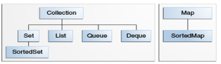

# Course notes for Java complete masterclass on udemy

## 3. First steps

- basic command line compilation (from src directory): `javac -cp . de/pkro/Main.java`
  - cp: classpath, current directory so packages used in main can be found
  
- **Primitive types are passed by value, Objects by reference; the original object can be changed (if it's not immutable) when passed as a parameter to a method**

### 8 primitive types

- **boolean** (Boolean)
- byte
  - occupies 8 bits ("byte has a **width** of 8")
  - -128 - 127
  - doesn't roll over but gets converted to int when adding number and it gets out of range
  - use to document that expected value is small / in that range
- char
  - must use single quotes: `char myChar = 'D';`
  - width: 16 bit (unicode)
  - unicode assignments are valid: `char arrow = '\U+2190';`
  - is an int internally and can be used in calculations and loops (`for(char c = 'A'; c <= 'Z'; c++)`) 
- short
  - width: 16 bit
  - -32768 - 32767
- **int**
  - width: 32 bit
  - used by default by java for numbers
  - when adding 1 to Integer.MAX_VALUE, it overflows (**rolls over**) (to Integer.MIN_VALUE) and reverse
  - when assigning a value hiher than MAX_VALUE, a compiler error occurs
  - for better readability, underscores can be used in numbers (2_010_232 = 2010232), java ^7
- long
  - 64 bit (integer)
  - must be assigned with an "l" or "L" if its over int range: long myLongValue = 100L;
  - long Min: -9223372036854775808
  - long Max: 9223372036854775807
  - **rolls over**
  - works well with int
- float
  - must be defined as literal with f suffix if number literal is a floating point (like *long*): `float x = 1.33f;` or cast directly from double `float x = (float) 1.33;`
  - 32 bit (single precission)
  - float min: 1.4E-45
  - float max: 3.4028235E38
- **double**
  - 64 bit (double precision)
  - default for floating-point numbers
  - Faster to process than double in almost all cases
  - can be defined with d suffix for literal numbers (double d = 5d;)
  - double min: 4.9E-324
  - double max: 1.7976931348623157E308

### Strings

- Class (not a primitive)
- concatenation with + works without explicit casting (`"dfsdfds" + 5;` is fine);
- "+" concatenation is inefficient, use StringBuffer
- immutable

### Sidenotes

- constants in Java are defines as **static** (can be used without creating class instance) **final** (can't change): `private static final double KG_FACTOR = 0.45359237d;`; Must be defined in *class*, not in method
- for precise fp calculations, **BigDecimal** should be used
- Packages: way to organize Java projects; companies use domain names reversed

### Casting

- Integers don't need to be explicitly cast to long
- Syntax:

      (type) value or variable;
      byte x = (byte) (6/2); // default data type is integer so 6/2 gets interpreted as an int by the compiler; as byte range is smaller than int, it needs to be explicitely cast

## Section 4 OperatorsExpressions, Statements, Code blocks

- use camel case, even for abreviations (correct: XmlHttpRequest, incorrect: XMLHTTPRequest)
- methods and variables start with lowercase, classes with uppercase

### Operators

- left / right associative as usual; "=" -> right associative, '+' or '-' left associative
- type comparison: **instanceof**
- precedence: as usual, https://introcs.cs.princeton.edu/java/11precedence/
- ++ / -- prefix / postfix as usual

### Statements

- syntactic entity in a programming language that may be evaluated to determine its value
- A statement is a complete unit of execution (`int x = 5;`)

3 types:

- Declaration statement (`int x = 5;`)
- Expression statement (expressions can become expression statements by adding a semicolon at the end)
  - Assignment expression (`x=5;`)
  - increment / decrement (`x++;`)
  - Method calls (`System.out.println("Test")`)
  - Object creation expressions (`Car ownersCar = new Car();`)
- Control flow statements

### Whitespace / indentation

- Nothing new

### Code blocks

- nothing new, new codeblock = new namespace with visibility of enclosing namespace

### Methods (basic)

- non-static methods can't be called on a non-static context, i.e. without object instantiation
- nothing noteworthy otherwise at this point

### DiffMerge Tool

- what it says; use something better.

### Methods overloading

- overloaded methods must have a differen parameter signature, a different return type doesn't suffice

### Sidenotes

- `return;` is valid for a void method (NOT `return void;`)

## Section 5 Control Flow

- switch, for, while, do while: nothing unexpected; String type switch added Java 7+

### String / number conversions

- Integer.parseInt() / Double.parseDouble etc.; throws exception if not a valid (integer|double|...) format
- concatenating int to string with "+" automatically converts the int

### User Input (command line)

    Scanner scanner = new Scanner(System.in);
    String input = scanner.nextLine();
    scanner.close();

- also nextInt, nextShort, hasNextInt etc. among others
- for multiple inputs that are terminated by enter (enter gets interpreted as the next input), use `scanner.nextLine();` before reading another input:

      System.out.println("Enter your birthyear: ");
      int birthYear = scanner.nextInt();
      System.out.println("Enter your name: ");
      scanner.nextLine();
      String name = scanner.nextLine();

- user input type check pattern:

      System.out.println("Enter your choice: ");
      int choice = -1;
      while(choice == -1) {
        if(scanner.hasNextInt()) {
          choice = scanner.nextInt();
        } else {
          System.out.println("Please enter only numbers.");
        }
        scanner.nextLine();
      }

### Sidenotes

- Example date / formatting / conversion: Condensed getting current year:
  
  `int currentYear = Integer.parseInt(new SimpleDateFormat("YYYY").format(new Date(System.currentTimeMillis())));`

## Section 6 OOP part 1

### Classes

- class files are created in namespace folder, e.g. /de/pkro

      [optional access modifier] class ClassName
      [public|private|protected] class ClassName

- instance variables (=fields) -> state of class (or rather it's derived object)
- refered to inside function with this.varName (if parameter naming conflict, otherwise just varName)

- Object instantiation:

  [Classname] varName = new [Classname]([params])

### Constructor

- method with only access modifier (always public), *no return type* and method name = class name
  - can actually be set to private to make it impossible to instantiate the class, example: Math
- to overload a constructor with a constructor that assigns default values, call the constructor that accepts values with "**this**":

      // all parameters
      public BankAccount(long accountNumber, double balance, String customerName, String email, String phoneNumber) {
        this.accountNumber = accountNumber;
        [...]
      }

      // no parameters
      public BankAccount() {
          this(12345, 0, "Default name", "default email", "default phone");
      }

      // some parameters
      public BankAccount(String customerName, String email) {
          this(12345, 0, customerName, email, "default phone");
      }
  
- generally it's regarded as better to assign the values directly (`this.name = name;`) in the constructor as opposed to using the setters (`setName(name);`) in the constructor; reasons:
  - initial values are guaranteed to be initialized
  - not all variables that are necessary for validation of another value might have been initialized

### Inheritance

- a class can have only one superclass (but can implement multiple interfaces, see section 9 below)
- all classes inherit from `Object`
- `public class XXX extends YYY {[...]}`
- constructor call with super

      public class Dog extends Animal {
          public Dog(String name, int brain, int body, int size, int weight) {
              super(name, brain, body, size, weight);
          }
      }

- override methods with **@Overri (optional**, hint for compiler / IDE to catch errors when efining overridden methods):

      @Override
      public void eat() {
          super.eat();
          chew();
      }

- if a method has a different signature (but the same name) as the one in the parent class, it's **overloaded** and **not overridden**
- to call methods from the superclass, it's better practice to call them without super in case they are later overrridden (unless the superclass method version should explicitely be called)
- **this** is used to call current class members; usually used in constructors and setters, sometimes in getters
- **super** to call parent class; commonly used in method overriding 
- both can't be used in a static context
- **super()**: Java puts a default call to super() in the constructor to call the argument-less constructor of the parent class if we don't add it ourselves
- the **super()** call must be the first statement in the constructor if it's done explicitely
- Even abstract classes have a constructor
- Don't put @Override over constructor
- A constructor can have a call to super() or this() but not both

### Overloading / Overriding

#### Overloading

- Overloading is sometimes refered to as compile time polymorphism (though it isn't polymorphism in the inheritance sense)
- both static and instance methods can be overloaded
- Overloaded = same method name but different parameters, **may or may not** have different return types / access modifiers / exceptions
- usually methods get overloaded in a single class, but a class overloads the parent class' method (no @Override necessary then)

#### Overriding

- aka "runtime polymorphism"
- means defining a method in the child class with the same name and signature as one in the parent class
- recommended to put @Override above method definition to let IDE / compiler catch errors
- only instance methods can be overridden
- return type can (only) be a subclass of the return type in the parent class
- can't have a lower access modifier (e.g. if parent method: protected, child method can be public but not private)
- Constructors and private methods can't be overridden
- Final methods can't be overridden
- subclass can still call overridden method version from parent class by using super.methodName

### Static vs Instance methods

#### Static methods

- can't use this in static methods
- methods that don't use instance variables should be declared static

#### Instance methods

- can only be used in class instance (method)
- can access instance as well as static methods/variables directly

### Static vs instance variables

#### static variables ("static member variables")

- declared with `static`
- shared with all class instances
- **if changed, value in all other instances will change too**
  
      public class StaticVarTest {
        public static int maxSpeed = 100;
      }
      // in main
      StaticVarTest a = new StaticVarTest();
      StaticVarTest b = new StaticVarTest();
      a.maxSpeed = 5;
      System.out.println(b.maxSpeed); // 5

- used for example to instantiate a Scanner that can be used in all methods

#### Instance variables

- every instance has its own copy / value

### Sidenotes

- String comparison with .equals method (`firstName.equals("pkro")`)
- Check if String is empty / uninitialized .isEmpty()
- default toString method outputs classname and object id
- Reference assignments as usual

## Section 7 OOP part 2

### Composition

- Inheritance: "is-a" relationship between subclass and parent class
- Composition: "has-a" relationship: Monitor class has Resolution class
- basically using other classes / types in a class and construction a parent class from other class components

      Dimensions dimensions = new Dimensions(20, 20, 5);
      Case theCase = new Case("22b", "Dell", "240", dimensions);
      Monitor theMonitor = new Monitor("27incher", "Iiyama", 27, new Resolution(2540,1440));
      Motherboard motherboard = new Motherboard("apc200","apc", 4, 2, "1.5");
      PC pc = new PC(theCase,theMonitor,motherboard);

#### how to access methods of components? 

- example: pressPowerButton is defined in Case, but we want to access it from the pc object.
- solution 1: using the getters (duh!):

      pc.getCase().pushPowerButton();
      pc.getMonitor().drawPixelAt(20,30,"green");

- solution 2: making getters in the class that uses the components private (or removing them alltogether) and wrapping the component's methods:
      
In PC class:

      public void powerUp() {
        theCase.pressPowerButton();
        drawLogo();
      }

      public void drawLogo() {
          monitor.drawPixelAt(40, 30, "purple");
          monitor.drawPixelAt(40, 30, "green");
      }

- solution 3: both of the above

#### Where to use inheritance and where composition?

- rule of thumb: composition first as it doesn't create unwieldy class hierarchies
- works well with the functional paradigm
- easier to test / write tests for individual classes

### encapsulation

- encapsulate member variable access in methods
- protects from variable name changes affecting classes using it
- enables checks before accessing members

### Polymorphism

- basically method overloading. Subclass IS-A Parentclass, but Parentclass IS_NOT_A Subclass
- Might want to add more explanations here but this seems intuitive and already covered during method overriding section
- [There obviously is more to it](https://www.infoworld.com/article/3033445/java-101-polymorphism-in-java.html)

### Sidenotes

- Strg-Shift-Space shows method parameters when typing (can be enabled to be always shown)
- "sout"+tab = System.out.println
- Strg-F12 shows method / class implementation (where cursor is)
- classes can be declared inline in the file of another class (e.g. class Main), but then "public" keyword isn't allowed as the class can't be accessed from outside the file.

## Section 8

### Reference Types vs Value Types

- nothing surprising, primitives are passed / assigned by value, Objects (such as Arrays) by reference
- methods can dereference (=re-initialize) array references passed in parameters:
- parameters are just copies of the pointers to the object

      public static void doSomething(int[] array) {
        array[2] = 2; // modifies array referenced by "array"
        // overwrite / dereference reference LOCALLY
        array = new int[] {1,2,3}; // creates new array and references it by "array"
      }

### Arrays

- nothing surprising index-wise or standard properties like .length
- can hold all types
- typed (no mixed content)
- Array initialization

      // with sizing (all array elements are initialized to zero (0)):
      int[] myArray = new int[10];
      System.out.println(Arrays.toString((new int[5])));
      // -> [0, 0, 0, 0, 0]
      
      // without values
      String[] days;
      
      // with values:
      String[] a = new String[] {"a","b","c"};
      
      // with values in an anonymous array:
      String[] days = {"Monday","Tuesday"};
      
      // gets compiled but flagged by IDE (local c style array), why?
      String days[];
      String days[] = {"Monday", "Tuesday"};

- Resizing arrays: 
  - By hand: create new reference of original, dereference original variable and copy content of newly created reference in the dereferenced one
  - Use array list (see next point)

### List / ArrayList

- can only be used with classes, not primitives (use wrapper Integer etc. for that, see autoboxing below)
- ArrayList inherits from list (or rather AbstractList interface)
- when adding values to ArrayList, capacity grows automatically
- Ordered collection
- Instantiate with Type in pointy brackets and constructor call with brackets
- append with .add (single item) or .addAll (from collection / list)
  - java needs to move all elements after the inserted one up an index, this is slower than using a LinkedList where only 2 addresses need to be amended - see LinkedList section below
- insert with add(index, item)
- instead of .length property as in arrays, use .size() method
- access items by index with .get(index)
- update with .set(index, newItem)
- remove items with remove (overloaded to accept object to be removed or index (and probably more).
- more methods such as copying just see example code below
- also a lot of useful .stream() methods  
- making a copy of a list using a list constructor returns a *shallow* copy: `List<Theater.Seat> seatsCopy = new ArrayList<Theater.Seat>(theater.seats);`
  
      ArrayList<String> groceryList = new ArrayList<String>();
      // explicit type specification in constructor can be left out:
      ArrayList<String> anotherList = new ArrayList<>();
      groceryList.add("Wurst");
      groceryList.add("Bier");
      groceryList.add("Coke");
      System.out.println(groceryList.toString()); // [Wurst, Bier, Coke]
      groceryList.set(2, "Whisky"); // [Wurst, Bier, Whisky]
      groceryList.remove(1); // [Wurst, Whisky]
      groceryList.remove("Wurst"); // [Whisky]
      groceryList.contains("Whisky"); // true; "contains" returns just indexOf(obj) >= 0
      groceryList.add(0, "Milk"); // [Milk, Whisky]
      //ways to copy with addAll or ArrayList constructor:
      ArrayList<String> newArrayList = new ArrayList<String>();
      newArrayList.addAll(groceryList);
      ArrayList<String> nextArray = newArrayList<String>(groceryList);
      
      // copy to array
      String[] myArray = new String[groceryList.size()];
      myArray = groceryList.getGroceryList().toArray(myArray); // needs array as param again

      // foreach iteration also possible as in arrays:
      for(String item: groceryList) {
        System.out.println(item);
      }

### Autoboxing / Unboxing

- primitive type ArrayLists must use wrapper class (`<Integer>, <Float> etc`)
- explicit not necessary when adding values (autoboxing)
- automatically converted back on access (unboxing)
- both at compile time

### LinkedList

- works like every linked list (val, next) + tons of methods
- is implemented in java as doubly linked list to allow for moving back and forward
- performant for inserting items 
- instantiation like ArrayList, *boxing applies
- Storage in memory:
  - Primitives: Java calculates memory position by max amount of bytes the given *primitive* type requires and stores them directly:
    
    - this makes it possible to quickly look up items by index as a formula to calculate the memory address can be used: base address + (primitive type byte size) * index 
  - For objects (such as strings), the *address* of the object is saved in the linkedlist:
    
    - same easy index calculation possible despite variable length
  - how is that something worth mentioning specifically for linked lists? Isn't this the basic distinction of how primitives and objects are stored / passed?
- Iterate using enhanced for (recommended) or explicitely with iterator

      LinkedList<String> placesToVisit = new LinkedList<>();
      placesToVisit.add("Sydney");
      placesToVisit.add("Brisbane");
      placesToVisit.add(1, "Perth"); // insert at 1 and move other entries "up"
      placesToVisit.remove(1);
      // iterator
      Iterator<String> i = placesToVisit.iterator();
      while (i.hasNext()) {
        System.out.println(i.next());
      }

      // enhanced for
      for (String s : placesToVisit) {
        System.out.println(s);
      }

- use ListIterator to be able to move back with iterator and added functionality

      // this method should rather work on a copy of the list to avoid side effects,
      // but for brevity's sake this alters the passed LinkedList itself
      private static boolean addInOrder(LinkedList<String> linkedList, String city) {
        ListIterator<String> stringListIterator = linkedList.listIterator();
  
        while(stringListIterator.hasNext()) {
            int comparison = stringListIterator.next().compareTo(city);
            if(comparison==0) {
                // equal, don't add
                System.out.println(city + " is already included");
                return false;
            } else if(comparison > 0) {
                // new city should appear before the current one
                stringListIterator.previous(); // go back
                stringListIterator.add(city);
                return true;
            }
        }
        stringListIterator.add(city); // the end
        return true;
      }

- iterator.getFirst() gets first entry from iterator without moving it like news()
- java ListIterator is implemented in a way to avoid recursive loops in structures, so the iterator is acutally "in between" two list nodes and not "On" one; (one) solution is to keep track of the direction the iterator is moving and doing an additional "next()" or "previous()" to move back and forth with the iterator 
- Arrays are collection based and not a valid argument for .addAll or in the List constructor; use Array.asList as a bridge:
  
      // with explicit array creation
      list.addAll(Arrays.asList(new String[]{name, Integer.toString(hitPoints), Integer.toString(strength), weapon}));
      // without (asList is overloaded):
      list.addAll(Arrays.asList(name, Integer.toString(hitPoints), Integer.toString(strength), weapon));

### Sidenotes

- "enhanced for loop" (basically foreach?):
  
      for(int i=0; i<arr.length; i++) { System.out.println(arr[i]); }
      // is the same as (ACCESS only, changing "value" doesn't change the array)
      // no index access possible like in most other languages foreach construct
      for (int value : arr) {
            System.out.println(value);
      }

- Copying array
  - Arrays.copyOf(array, array.length)
  - System.arraycopy
  - arrayObj.clone()
  - may more
  - by hand
- Array**s**.stream() has A LOT of useful / functional functions such as map, skip etc.
- skipping first value: `String[] days = Arrays.stream(javaDays).skip(1).toArray(String[]::new);`
- Intellij:
  - alt-j for multi selection (ctrl-d in vscode)
  - ctrl-shift-enter completes statement, adds ; at end and goes to next line
  - shift-enter to insert and go to next line without breaking current line 
  - Strg-Alt-M to extract selected code to method
  - select, copy, select other, right click + "compare with clipboard" = easy partial diff
- reminder iterator protocol: the first call to iterator.next() actually goes to the first entry, NOT to the second 

## Section 9

### Interfaces

- define behavior of class without implementations, just define the methodss
- don't have / define constructors
- commitment that the class interfaces (method return types, signatures etc) will not change
- public is redundant for interface methods and can/should be left out
- use good interface names, e.g.:
  - ISaveable (don't do the prefix anymore as IDEs show if a file is an interface these days)
  - Saveable
  - CanSave
  
**I**Telephone.java:

      public interface ITelephone {
        // these methods must be implemented by classes implementing it
        public void powerOn();
        public void dial(int phoneNumber);
        public void answer();
        public boolean callPhone(int phoneNumber);
        public boolean isRinging();
      }

DeskPhone.java:

      public class DeskPhone implements ITelephone {
        int myNumber;
        //...
    
    
        public DeskPhone(int myNumber) {
            this.myNumber = myNumber;
            // ...
        }
    
        @Override
        public void powerOn() {
            isPowered = true;
        }
        @Override
        public void dial(int phoneNumber) {
            System.out.println("Dialing " + phoneNumber);
        }
    
        @Override
        public void answer() {
              //...
        }
    
        @Override
        public boolean callPhone(int phoneNumber) {
          //...
        }
    
        @Override
        public boolean isRinging() {
            return isRinging;
        }
      }

- Interface *can* be used as type:

      ITelephone timsPhone = new DeskPhone(123456);
      DeskPhone anotherPhone = new DeskPhone(34455);

- NOT valid (unless implementing an inner / inline class):

      ITelephone timsPhone = new ITelephone(123456);

- example java library: LinkedList, ArrayList, Vector and other list types use List interface, so by declaring List for object and parameter types the actual list implementation can be changed easily
- Lists should generally be declared with the generic interface List to make implementations more flexible (can use any subclass of List), even omitting type declaration:
      
      // probably too narrowly defined types:
      public interface ISaveable {
        ArrayList<String> write();
        void read(ArrayList<String> savedValues);
      }

      // probably better to allow flexible use and implementation:
      public interface ISaveable {
        List write();
        void read(List savedValues);
      }

- If the class has a method not defined in the interface, and the object was declared using the Interface type, the object must be cast to the class type to call the method:

      ISaveable werewolf = new Werewolf();
      werewolf.save(); // ok as save() is defined in interface
      werewolf.changeToSpookyForm(); // NOT ok as changeToSpookyForm is werewolf class specific
      ((Werewolf) werewolf).changeToSpookyForm(); // OK
  
- Interface or inheritance from superclass?
  - Depends: mobile phone is a computer that can also be used as a phone, so it *can* do the things a telephone does but much more, so an interface is the best choice here
  - In java a class can have only **one** superclass, but multiple interfaces, so, again, a mobile phone could inherit from ITelephone and IComputer
  - "Animal" example:
    - Bird extends Animal implements IFly implements IWalk
    - Dog extends Animal implements IWalk
    
### Inner classes

#### non static nested class:

      public class Gearbox {
      private ArrayList<Gear> gears;
      private int gearNumber = 0;
      // ...
          public Gearbox(int maxGears) {
              this.gears = new ArrayList<>();
              
              // ...
          }
  
          private class Gear {
            private int gearNumber = 5; // shadows parent classes gearNumber variable
            gearNumber = Gearbox.gearNumber; // this.gearNumber is now 0
              // ...
          }
      }

- use when class doesn't make sense without the context of the outer class (in the example, Gear will only ever be instantiated by Gearbox)
- can improve encapsulation  
- outer class variables can be accessed directly if no naming conflict exists
  - *best to use unique names to avoid confusion and hard to find bugs caused by variable shadowing*
- explicit instantiation of inner class (only possible with instance of enclosing class) with .new:

      Gearbox mcLaren = new Gearbox(6);
      Gearbox.Gear first = mcLaren.new Gear(1, 12.3);
      // new Gearbox.Gear(...) is not possible, neither is new mcLaren.Gear(...)

  - this is normally not necessary as it contradicts making it an inner class in the first place
  - best practice would be to make inner class private to avoid external instantiation
  
#### inner class implementing an inner interface from another class 

- an inner interface gives a template to create a class that is only of concern in the context of the outer class
- example Section 9 inner classes button: 
    
      // Button.java
      public class Button {
        private String title;
        private OnClickListener onClickListener;
        // ...
        public interface OnClickListener {
            public void onClick(String title);
        }
      }
  
      // Main.java
      public class Main {
        private static Button btnPrint = new Button("yay button print");
        // ...
        public static void main(String[] args) {
            // ...
            // local class implements Buttons inner OnClickListener interface
            class ClickListener implements Button.OnClickListener {
              public ClickListener() {
                  System.out.println("I've been attached");
              }
    
              @Override
              public void onClick(String title) {
                  System.out.println(title + " was clicked");
              }
            }
          }
        }
        
        btnPrint.setOnClickListener(new ClickListener());;
      }

#### anonymous classes

- have to be declared and instantiated at the same time, similar to javascript anonymous classes
- very common for attaching event handlers

      anotherButton.setOnClickListener(new Button.OnClickListener() {
        @Override
        public void onClick(String title) {
        System.out.println("Anonymous event listener class onClick event");
        }
      });

#### abstract classes
- keyword abstract
- class that defines method definitions like interfaces but implements *some* methods
- can't be used on its own, needs to be inherited from and forces ancestor class to implement the missing methods
- private vars / methods not accessible in child class (like always), use protected if needed

      public abstract class Animal {
      private String name;
      
          public Animal(String name) {
              this.name = name;
          }
      
          public abstract void eat(); // needs implementation
          public abstract void breathe(); // needs implementation
      
          public String getName() {
              return name;
          }
      }

      public class Dog extends Animal {
        // constructor needs to be implemented
        public Dog(String name) {
          super(name);
        }
        @Override
        public void eat() {
          System.out.println("Dog "+getName()+" eating");
        }
      
        @Override
        public void breathe() {
          System.out.println("Dog "+getName()+" breathing");
        }
      }

- Abstract classes can inherit from abstract classes:
      
      // Bird.java 
      public abstract class Bird extends Animal {
          public Bird(String name) {
            super(name);
          }
      
          @Override
          public void eat() {
              System.out.println("Bird "+getName()+" eating");
          }
      
          @Override
          public void breathe() {
              System.out.println("Bird "+getName()+" breathing");
          }
          
          // for examples sake - this should actually better be in an interface as bats and flies can fly too
          public abstract void fly();
      }

      // Parrot.java
      public class Parrot extends Bird {
        public Parrot(String name) {
          super(name);
        }
      
        @Override
        public void fly() {
            System.out.println("Parrot can't fly");
        }
      }

- As with interfaces, the parent abstract class can be used as a type:

      Bird parrot = new Parrot("sparrow");

#### Interface vs abstract class

- Interface: 
  - has-a relationship (player has a save method)
  - just declaration, no implementation **since Java 8 also `default` methods with implementations**
  - can only have public static final variables
  - all methods in interfaces are automatically public and abstract **since Java 9 also private methods (commonly used when 2 default methods in an interface share common code)**
  - can only have abstract methods
  - A class can implement multiple interfaces
  - decouples "what" from "how" 
  - Use when:
    - designing the program (rather than the implementation)
    - expect unrelated classes to implement the interface (many things can be "saveable")
    - good example: Collections API, JDBC API
  
- Abstract class: 
  - is-a relationship (player is a GameActor)
  - can have member variables, constructors
  - can have any visibility (public, private, protected)
  - can have both abstract and implemented methods
  - A class can inherit only from one abstract class
  - if the sublcass doesn't implement all abstract methods, it must be an abstract class itself
  - Use when:
    - share code / member variables among several closely related classes
    - subclass is expected to have many common methods / members or requires access modifiers other than public
  
- both:
  - can't be instantiated by themselves
  
### Sidenotes 

- Intellij: set up emmet like abreviations under settings->editor->live templates, e.g. scn -> Scanner scanner = new Scanner(System.in);
- Intellij: ctrl-d to duplicate selected text
- Intellij: alt-6 show problems
- Intellij: enable multiple windows: File -> Settings -> Appearance and Behavior -> System Settings

## Section 10 generics (since java 1.5)

- Use to catch errors at compile time as opposed to hard to catch runtime errors
- ArrayList can be defined without type (then the default type is "Object" which can hold anything)
- this can lead to runtime errors if incompatible types are cast:

      public static void main(String[] args) {
        ArrayList items = new ArrayList();
        items.add(1);
        items.add("Jack");
        items.add(3);
        for (Object i: n) {
          System.out.println((Integer) i*2); // runtime error on second item
        }
      }
    
      
- intellij warns of using raw types
- use <> to indicate type to catch runtime errors:

      // ArrayList<Integer> items = new ArrayList<Integer>();
      // best way (Java 7+, "diamond operator"): 
      ArrayList<Integer> items = new ArrayList<>();
      items.add(1);
      items.add("Jack"); // compile error, can be caught by IDE

      for (Object i: n) {
        System.out.println(i*2); // casting not necessary anymore
      }

### Adding generics to own class

Before - this class allows to add any subclass of player regardless what sports team it is:

    public class Team {
      private String name;
      ArrayList<Player> members = new ArrayList<>();
  
      public Team(String name) {
          this.name = name;
      }
  
      public boolean addPlayer(Player player) {
          // ...
      }

      public void matchResult(Team opponent, int ourScore, int theirScore) {
        // ...
      }
    }
    
    

    Team adelaide = new Team("Adelaide crows");
    adelaide.addPlayer(new FootballPlayer("Joe"));
    adelaide.addPlayer(new BaseballPlayer("pat"));

After - class must be initialized with the correct player type:

    public class Team<T> {
      private String name;
      ArrayList<T> members = new ArrayList<>();
  
      public Team(String name) {
          this.name = name;
      }
  
      public boolean addPlayer(T player) {
          // ...
      }
      
      public void matchResult(Team<T> opponent, int ourScore, int theirScore) {
        // ...
      }
    }

    Team<FootballPlayer> adelaide = new Team<>("Adelaide crows");
    adelaide.addPlayer(new FootballPlayer("Joe"));
    adelaide.addPlayer(new BaseballPlayer("pat")); // compile error

`<T>` is a placeholder for the concrete type given on initialisation.

Problem: this compiles fine but leads to runtime errors when initialising with a non-compatible type (such as String) and trying to cast a non-player type to Player;

    Team<String> adelaide = new Team<>("Works fine...");
    adelaide.addPlayer(new String("Throws error at runtime if cast to player"));
    
Solution: restrict type of class by using **bounded type parameters** using `extends`:

    public class Team<T extends Player> { //... }
    Team<String> noworky = new Team<>("compile error");

Now the upper bound of Team is the player class.

- type given on initialisation can be class or interface
- Interfaces can specify type parameters as well
- allows multiple types (bounds) (1 class and multiple interfaces):
    
      // Player = class, Coach, Manager = Interfaces
      public class Team<T extends Player & Coach & Manager>

- implementing an interface with type:

      public class Team<T extends Player> implements Comparable<Team<T>>

- multiple type generic Types are possible in class definition to enforce initialisation with specific combinations:

      public class Team<U extends Player, T extends Team> {...}
      League<FootballPlayer, Team<FootballPlayer>> league = new League<>("only footballers");

      // or just (easier):
      public class Team<T extends Team> {...}
      League<Team<BaseballPlayer>> baseballLeague = new League<>("the baseballers");

### Sidenotes

- Collections.sort uses the compareTo method implemented from the Comparable interface
  - sorts in-place
  - descending: `Collections.sort(teams, Collections.reverseOrder());`
- String repeat method (Java 11): `System.out.println(name + "\n" + "=".repeat(name.length()));`
- Pre- Java 11: `repeated = new String(new char[n]).replace("\0", s);`
- Apache commons for a lot of String, array and more utilities: [**https://commons.apache.org/**](https://commons.apache.org/)

## Section 11

### Naming conventions

- **Packages**: always lower case, unique, internet domain name reversed as prefix (de.pkro.mypackage), no dashes / starting numbers (replace / prepend with _), start with _ if it clashes with java keyword ,e.g. 1-world.com -> com._1_world
- **Class names**: CamelCase, UcFirst, should be nouns
- **Interfaces**: UcFirst
  - Consider what object implementing the interface will become / be able to do:
    - List
    - Comparable
    - Serializable
    - etc.
- **Method names**: mixedCase, often verbs
- **Constants (static final)**: all uppercase, _ to separate (e.g. MAX_CASE)
- **variable names**: mixedCase, no underscores
- **Type parameters**: Single character, capital letters e.g. 
  - E - Element (used extensively by Java Collections Framework)
  - K - key
  - T - type
  - V - value
  - S, U, V etc. -2nd, 3rd etc. types
  
### Packages

- bundles related packages
- stored physically on folder structure: /src/com/example/mypackage
- creates new namespace, avoids naming conflicts
- classes within package have unrestricted access to one another (but still restrict access from classes outside the package)
- Types / classes don't *have* to be imported on top but can be used with the fully qualified name in code: `javafx.scene.Node node = null;`
- this has to be done if multiple packages with the same Class have to be used (e.g. javafx.scene.Node AND org.w3c.dom.Node)
- namespace TLD.Domain.[...more subdomains].packagename
- `.*` doesn't add "sub-packages" automatically as they are *different* packages:

      import java.awt.*;
      import java.awt.event.WindowAdapter; // still necessary
      import java.awt.event.WindowEvent; // (or use import java.awt.event.*)

- when importing with `.*` from multiple packages, name clashes can occur if they contain classes of the same name
- com.example can be used for packages that aren't distributed
- Intellij: create folder structure automaticaly by naming class with package: `com.example.game.Player`

#### creating a jar file from a package:

- File -> project structure -> artefacts -> + button -> JAR -> From module with dependencies
- Indicate main class to make executable if desired
- extract to target jar
- ok
- build -> build artefacts -> build
- jar is created in /out/artifacts/

#### Use the created package (new project or existing):

- File -> projects structure -> libraries -> + button (java) -> go to folder and select .jar file
- library is accessible in project and visible under External Libraries in project pane
 
### Scope

- pretty much like javascript (in case of let / const, NOT var)
- block scope
- variables declared in local block of same name shadow variables in higher scope
- member variables (class level) of same name can still be accessed with `this.` prefix
- with inner classes, enclosing class member variables can be accessed `ParentClassName.this.variableName`, e.g. `ScopeCheck.this.privateVar`
  - same goes for calling enclosing class methods
- for loop variable is in loop scope (though not technically in {} )
- enclosing class can access private variables of inner class (with instantiation):
      
      public class ScopeCheck {
        public void useInner() {
          InnerClass inner = new InnerClass();
          System.out.println("InnerClass varThree=" + inner.varThree);
        }
        
        public class InnerClass {
          private int varThree = 3;
        }
      }
  
### Access modifiers

#### Top Level

- only classes, interfaces and enums can exist at top level
- public: visible to all classes in- and outside package
- package-private: only available within its own package; default if not explicitely declared with "public" (no "package-private" keyword exists)

#### Member level

- public: same as at top level (access anywhere)
- private: only accessible within the class; not possible for members in interfaces
- protected: accessible within the class and subclasses

### static

- static field is associated with class and not instance (but are also accessible and changeable by non-static methods of the class)
- static methods can only be called with classname.method(), not instanceName.method()
- main() as the application's entry point has to be static because there are no class instances at this point yet (by convention defined in class Main)
- non-static member variables and methods can't be accessed from static methods (main) because **when main is run, no instance exists yet**
- the reverse is not true (static methods and members can be accessed fine by non-static methods)

### final

- can be set / initialized only in declaration or in constructor (but NOT both); unchangable after constructor finishes
- basically a (possibly computed, so not at compile time) constant / immutable member variable
- for example giving "unique id" to an instance, see 016_section_11_access_modifiers, SomeClass.java
- for constants, use `static final` as there will be no need for a copy of a constant in an instance; they follow the same rules as other final variables in terms of declaration, meaning they can be computed as well. 
- class can be final; prevents from being subclassed. Example: Math is declared final (can't be inherited from) AND the constructor is private (can't be instantiated), so it can be ONLY used statically
- make methods final that should not be overridden

### static initialization blocks

- rarely used; best explained by code:

      public class StaticInitializationBlockTest {
        public static final String owner;
        static {
            owner = "Peer";
            System.out.println("Static initialization block called");
        }
        public StaticInitializationBlockTest() { // constructor
            System.out.println("Constructor called");
        }
        static {
            System.out.println("Second Static initialization block called");
        }
        // ....
      }
      
      StaticInitializationBlockTest sib = new StaticInitializationBlockTest();
      // Static initialization block called
      // Second Static initialization block called
      // Constructor called
      

### Sidenotes

- Intellij: ctrl-click on method (or ctrl-b when cursor is on method) goes to definition

## Section 12 - Collections

### Lists

- *"unified architecture for representing and manipulating collections."* - (https://docs.oracle.com/javase/tutorial/collections/)
- Core collection Interfaces:

- designed for interoperability / compatibility with each other and other types (ArrayList, LinkedList); valid: `private Collection<Seat> seats = new LinkedList<>();`
- implement comparable to be able to use efficient static search / sort / reverse etc. methods from Collections framework:
      
      // Seat class must implement Comparable, seats is an ArrayList of Seats
      int foundSeat = Collections.binarySearch(seats, requestSeat, null);

- static methods covered: Collections.shuffle, min, max, sort, reverse, binarySearch, swap
- to make a method accept a List of a certain class AND its subclasses, a wildcard can be used:

      public static void sortList(List<? extends Theater.Seat> list)
- most collection types can be instantiated with arrays using Arrays.asList(ar) passed to the constructor
### Exkurs: Comarable / Comparator

If a class doesn't implement comparator, a comparator can be passed to the Collections.sort (revere, etc.) method:
      
      // this one is defined in the parent class 
      // Theater in this case as a static (and final) method
      // because the inner class is usually private 
      static final Comparator<Seat> PRICE_ORDER = new Comparator<Seat>() {
        @Override
        public int compare(Seat seat1, Seat seat2) {
          if(seat1.getPrice() < seat2.getPrice()) {
            return -1;
          }
          else if(seat1.getPrice() > seat2.getPrice()) {
            return 1;
          }
        return 0;
        }
      };

      // usage:
      Collections.sort(seatsCopy, Theater.PRICE_ORDER);

Also check what intellij does if you click on the "split into declaration and initialisation" suggestion for an example of a static initialisation block as shown in the section above

"ordering being consistent with equal" in the Java Collections documentation means the comparator should only return 0 if the objects are actually equal (so a comparator that only compares one of many members doesn't compare for actual equality)

### Maps

- maps keys to values, (can) use generics, replaces dictionaries
- keys should be immutable (intellij / java will complain if not), e.g. objects
- not ordered 
- myMap.put(key, value) returns the previous value associated with the key
- self explaining: .containsKey, containsValue, 
- replace(key, newVal) or replace(key, oldVal, newVal) replaces only if key (or key value pair) exists, returns previous value
- .remove(key) or .remove(key, value) for specific key-val combinations (returns boolean)
- getOrDefault(searchKey, defaultItem) 
- specify key and value types in declaration:

      // String key, String value:
      Map<String, String> languages = new HashMap<>();
      languages.put("Java", "a compiled high level oo language");

      // don't forget to add it in the parameter signature for methods too:    
      public static void printMap(Map<String, String> m) {
        for(String key: m.keySet()) {
            System.out.printf("%10s: %-15s\n", key, m.get(key));
            //System.out.println(key + ": " + languages.get(key));
        }
      }

### Immutable classes

Protects classes / members from changes (e.g. by plugins or user-side code like in excel)

Some techniques:

- returning copies of class members:
  
      public Map<String, Integer> getExits() {
        // return copy so outside code can't change HashMap
        // (though object references could still be changed)
        return new HashMap<String, Integer>(exits);
      }
- making fields `private final`; makes it clear that it shouldn't be changed and ensures no accidental modification
- only provide setters where necessary
- make fields that should be final after instantiation as an argument to the constructor rather than setters:
      
      // instead of
      locations.put(2, new Location(2, "You are at the top of a hill"));
      locations.get(2).addExit("N", 2);
  
      // prefer this where aplicable:
      tmpExit = new HashMap<>();
      tmpExit.put("N", 5);
      locations.put(2, new Location(2, "You are at the top of a hill", tmpExit));
      
      // in Location constructor, make sure to instantiate a new list 
      // from the passed in reference, otherwise it could still be changed after
      // the fact.
      // In public Location(..., exits):
      this.exits = new HashMap<String, Integer>(exits);

- Don't allow the class to be subclasses, see access modifiers

See also [A Strategy for Defining Immutable Objects](https://docs.oracle.com/javase/tutorial/essential/concurrency/imstrat.html)
      
### Set / HashSet

- usual set properties (unordered, no duplicates)
- iteration and contains operations possible, no direct access like .get(idx)
- best performing implementation is `HashSet<>`, basically a HashMap without values (values are the keys)
- fast
- union operation with addAll (as duplicates are not added)
- when using own classes as values (keys) in HashSets, Objects **equals** and **hashCode** should be **overridden**; otherwise, just referential equality (is it the same object) is used to determine uniqueness in set

      // from Object.java
      public boolean equals(Object obj) {
        return (this == obj);
      }

- 2 objects that compare equal must have the same hashcode 
- the hashcode is NOT used for comparison in a hashSet but to put them into buckets to facilitate search
>If two objects have the same hashcode then they are NOT necessarily equal. Otherwise you will have discovered the perfect hash function.
But the opposite is true: if the objects are equal, then they must have the same hashcode.

[StackOverflow answer](https://stackoverflow.com/questions/5443136/are-two-java-objects-with-same-hashcodes-not-necessarily-equal/5443140)

This does still work to remove duplicates and meets the requirement that two objects that are the same have the same hashcode:

    @Override
    public int hashCode() {
        return 0; // all fall in bucket 0
    }

Problem: This puts all items in the same bucket in the HashMap, reducing performance benefits of hash collection class.

When overriding equals, make sure to use the correct signature so it gets actually used, otherwise it's just overloaded:
      
    // WRONG (and intellij will complain that nothing is actually overridden):
    @Override
    public boolean equals(HeavenlyBody obj) { ...

    // Correct (best let these be generated by intellij anyway):          
    @Override
    public boolean equals(Object obj) {...
      // don't forget to cast obj to the object needed, e.g.
      String objName = ((HeavenlyBody) obj).getName();

[Documentation and rules for hashCode and equals](https://docs.oracle.com/javase/8/docs/api/java/lang/Object.html#hashCode--)

Set operations from [Java tutorial](https://docs.oracle.com/javase/tutorial/collections/interfaces/set.html):

- s1.containsAll(s2)  returns true if s2 **is a subset** of s1. (s2 is a subset of s1 if set s1 contains all of the elements in s2.)
- s1.addAll(s2)  transforms s1 into the **union** of s1 and s2. (The union of two sets is the set containing all of the elements contained in either set.)
- s1.retainAll(s2)  transforms s1 into the **intersection** of s1 and s2. (The intersection of two sets is the set containing only the elements common to both sets.)
- s1.removeAll(s2)  transforms s1 into the (asymmetric) **set difference** of s1 and s2. (For example, the set difference of s1 minus s2 is the set containing all of the elements found in s1 but not in s2.)

No symetric difference method (items that appear in one OR the other, but NOT BOTH); can be obtained by removing intersection from the union:

### Potential issues with equals() and subclassing

When allowing a class to be subclass, take care deciding if equals / hashCode should be allowed to be overridden as we,, otherwise declare them as final.

### Sorted Collections

`Collections.unmodifiableMap(Map map)` Returns an unmodifiable **view** of the specified map; good to return immutable objects that don't allow modifications of the referenced objects; fast, as it doesn't create a copy but a view. **Objects in the collection can *still* be modified.**

Another way to iterate over a Map besides `for(ItemType item: list.keySet()) {...}`:

    for(Map.Entry<StockItem, Integer> item: list.entrySet()) {
      // item is of type Map.Entry<StockItem, Integer> and provides
      // methods like getKey() and getValue()
      totalCost += item.getKey().getPrice() * item.getValue();
      s += item.getKey() + ", " + item.getValue();
    }

`LinkedHashMap` works like hashmap but keeps insertion order. `unmodiefiableMap` keeps that order as it's just a view of the underlying Map, whatever specific subtype.

`TreeMap`
> The map is sorted according to the natural ordering of its keys, or by a Comparator provided at map creation time, depending on which constructor is used.

- Treemap calls CompareTo when inserting items, resulting in the desired ordering but also doing more work when inserting items.

### Sidenotes

- Intellij: psvm => public static void main(....)
- Intellij: if more than one class has a main method, it can be run by right clicking in the code and selecting "run Blah.main" or ctrl-shift-f10
- convert char to uppercase (in this example while reading it in): `Character.toUpperCase((char) scanner.nextInt());`
- Math.cbrt = cube root ( `x = Math.cbrt(x*x*x)`)
- nested enums are a useful thing for constants to get errors at compile time when assigning wrong values:
- enums have also a default toString() method that returns the enum "name"
    
      public class HeavenlyBody {
        // ...
        protected enum BodyTypes {
          MOON, PLANET, DWARF_PLANET
        }
      }

## Section 13 - Javafx (incl. many other Java concepts)

### Installation

- not bundled with Java > 8
- Download sdk for OS at https://gluonhq.com/products/javafx/
- ctrl-shift-alt-s -> global libraries -> navigate to lib, select all .jar files, add

### Creating a hello world project (>java8)

- create javafx project
- file -> project structure -> global libraries -> right click javafx and add
- right click src folder, new, module-info.java -> add code (package name here is "sample")

      module HelloWorldFX{
        requires javafx.fxml;
        requires javafx.controls;
        opens sample;
      }

### Overview

- designed with MVC pattern in mind (separation of data and UI code)

- model:
- view: fxml (basically a ui description in a xml);

- Applications Main must extend `javafx.application.Application` (already configured when creating a javafx project)

- Stage: top level UI container
- Scene: backed by scene graph; can be build by hand or read in from fxml:

sample.fxml:

    (...)
    <GridPane fx:controller="sample.Controller"
    xmlns:fx="http://javafx.com/fxml" alignment="center" hgap="10" vgap="10">
    </GridPane>

Main.java:

public class Main extends Application {
    @Override
    public void start(Stage primaryStage) throws Exception{
        Parent root = FXMLLoader.load(getClass().getResource("sample.fxml"));
        primaryStage.setScene(new Scene(root, 300, 275));
        primaryStage.show();
    }

The same in code:

    @Override
    public void start(Stage primaryStage) throws Exception{
      GridPane root = new GridPane();
      root.setAlignment(Pos.CENTER);
      root.setVgap(10);
      root.setHgap(10);
      primaryStage.setTitle("Hello Javafx!");
      primaryStage.setScene(new Scene(root, 300, 275));
      primaryStage.show();
    }

- to change ui, load new graph (fxml) into scene and load it into new stage

### Layouts

#### GridPane

- define spacing and alignment in GridPane wrapper: `alignment="center" hgap="10" vgap="10"`
- Position with GridPane.rowIndex and .columnIndex:

- use gridLinesVisible="true" as wrapper property to debug positoning:

- Prefered size: determine how much space control gets (default: as much as it needs to display the content)
- defince column widths with columnConstraint:

      <columnConstraints>
          <ColumnConstraints percentWidth="70.0"/>
          <ColumnConstraints percentWidth="30.0"/>
      </columnConstraints>
- define pane conten with alignment, e.g. `alignment="top_center"`
- padding: 

      <padding>
          <Insets top="30"/>
      </padding>

- Span multiple columns with `<Button text="Hey!"  GridPane.rowIndex="3" GridPane.columnIndex="0" GridPane.columnSpan="2"/>`
- set h/v alignment with `GridPane.halignment="RIGHT"`

#### HBox

- usually used for dialogs / as child
- lays elements out vertically by default
- Limited css with -fx- prefix available (also in all other layout types?):

`<HBox xmlns:fx="http://javafx.com/fxml" fx:controller="sample.Controller" alignment="top_center"
style="-fx-border-color: red; -fx-border-width: 3; -fx-border-style: dashed;">`

- spacing: `spacing="10"`
- change spacing of elements (inside the element tag): ` prefWidth="90"`

#### BorderPane

- most commonly used for top level windows
- places controls in one of 5 positions: top, bottom, left, right, center